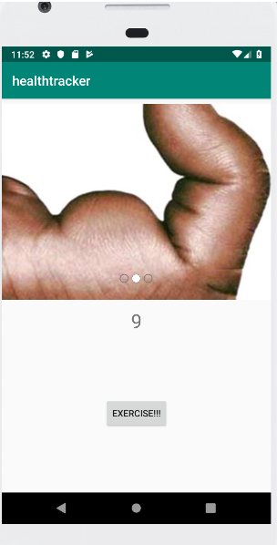
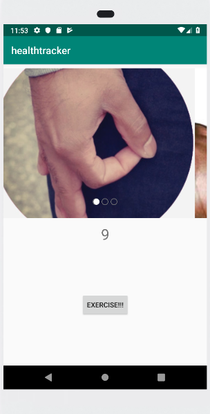

# healthtracker

### Application Description
      This application is going to be the continued ongoing work of multiple labs to create a fitness application. Each day I will add 
      more content to the app and add new features.
      
### Daily Logs

#### Lab 26
      Lab 26 consist of creating a home page with a finger fitness button. This button is on a counter to show you just how many reps your
      finger has accomplished. Each rep is literally just touching the counter button, but maybe it will do something more than just
      wearing out your phone.
      
      There is also a carousel of really jacked up pointer fingers to make sure that you are staying really motivated and continue pushing
      through the finger pain.
      
      Lab 26 Resources
      - Carousel library: https://github.com/sayyam/carouselview
      - Black and White finger pic: https://twitter.com/justinobieobert/status/618424658476412928
      - Strong Finger color pic: https://www.google.com/search?q=strong+finger&rlz=1C1CHBF_enUS813US813&source=lnms&tbm=isch&sa=X&ved=0ahUKEwjT8fShma3iAhVJFjQIHXtdAcEQ_AUIDigB&biw=819&bih=673#imgrc=kJKKEeX6Siu0UM:
      - Circle Game pic: https://www.google.com/search?rlz=1C1CHBF_enUS813US813&biw=1600&bih=758&tbm=isch&sa=1&ei=_TvkXLWWCfq-0PEP0eq8EA&q=circle+game&oq=circle+game&gs_l=img.3..0l10.34327.35598..35712...0.0..0.66.591.11......1....1..gws-wiz-img.......0i67.2oPEx_NnWqY#imgrc=uo8dm5t9y132NM
      

    
#### Lab 27
        Lab 27 consists of creating a separate activity page to handle the finger exercise and to leave the main activity page completely 
        free and open to navigation and welcome page use. 
        
        Instead of making the button with intent to navigate between pages, I went with the other option granted on the lab and that was
        to try and implement a navigation window/drawer. I figured this would look a lot cleaner over the next few weeks as this project
        is going to continue to add on more and more activities and will inevitably need to have a navigation window factored in at some
        point.
        
        Lab 27 Resources
        - Navigation Drawer: https://stablekernel.com/using-fragments-to-simplify-android-navigation-drawers/
        

#### Lab 28
    Lab 28 is the creation of a database which is used to store Exercises. Each exercise has a title, quatity, description, and a timeStamp.
    The exercises will be displayed on a seperate activity page with an input form available to add additional exercises to the page list.
    
    Currently, I have gotten the database setup, and have an exercise added to the database and displaying on the activity page. What I don't
    have is an operational input form on that page.
    

  
  
#### Lab 29
    Lab 29 is the creation and implementation of a RecycleView to show Exercises from the database. The Exercises should be displayed
    where they previously were on the activity page except with the recycleView instead of the textView.
    
    *****************************Update*************************************

********************************Update**************************************

#### Lab 30
    

